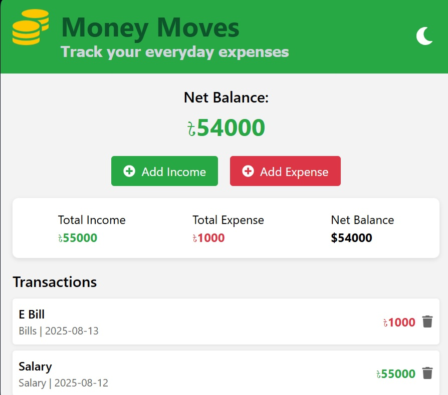
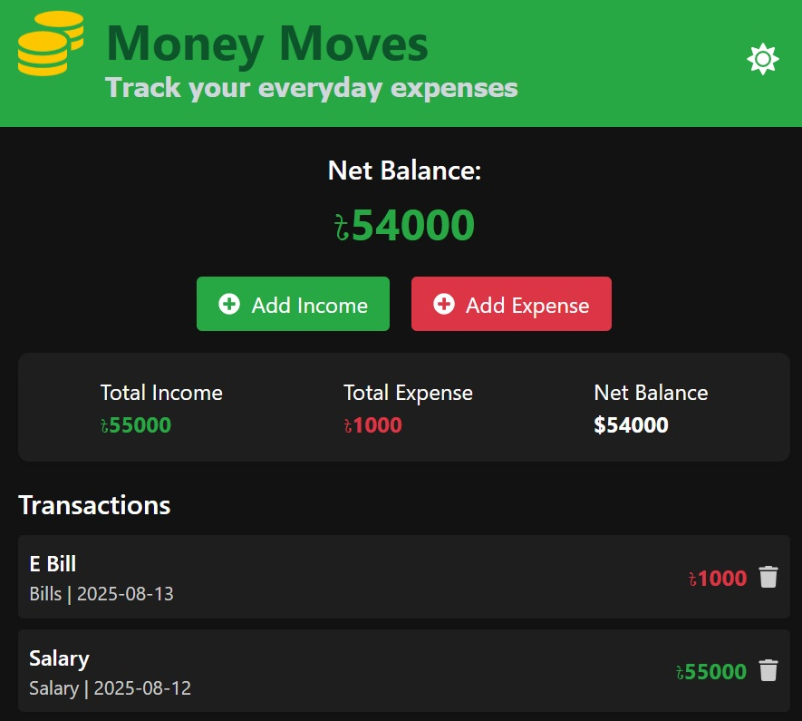
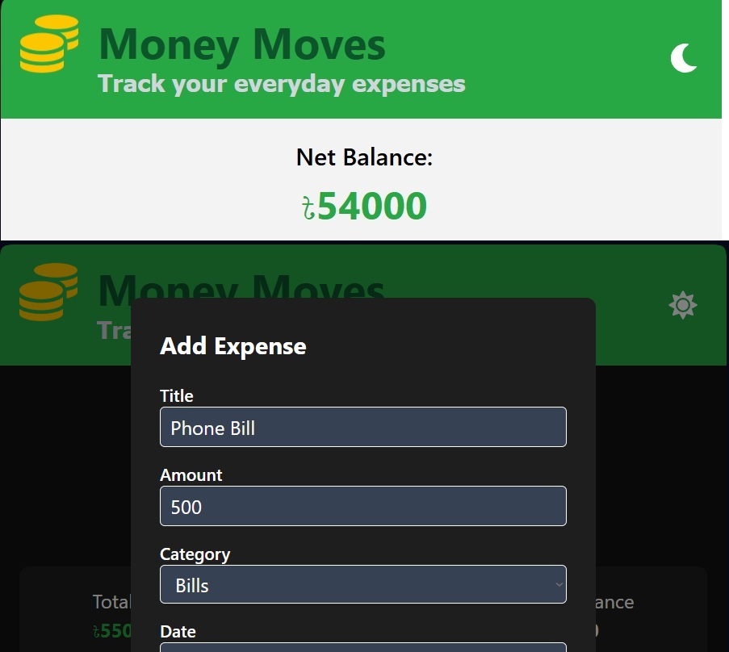
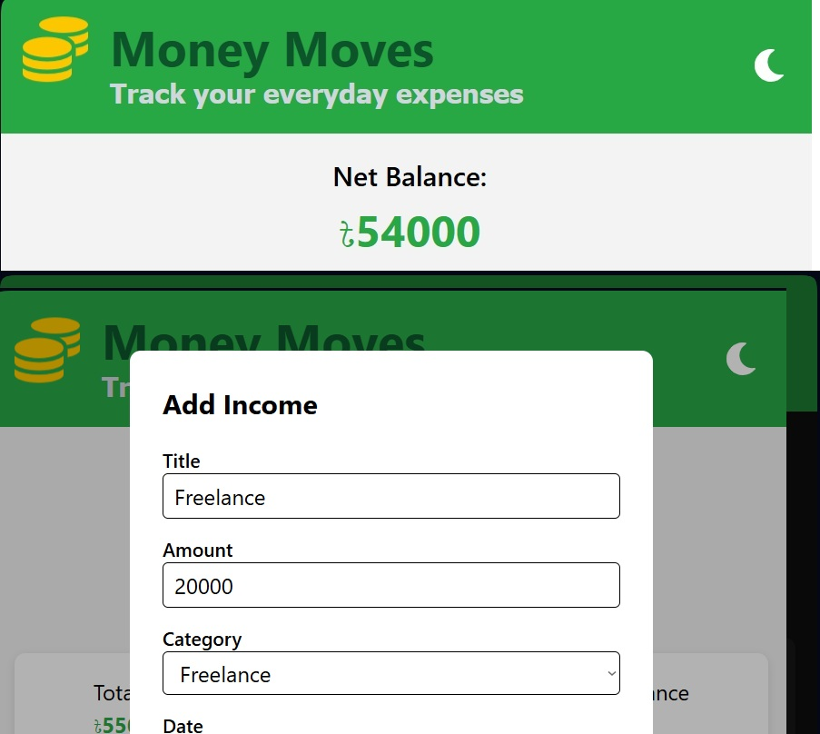

# Money Moves

A simple **Expense Tracker** built with **React** and **TailwindCSS**.  
Track your income and expenses, view your net balance, and manage transactions easily.

## Screenshots







## Features

- Add Income and Expense via modals
- View transactions with date, category, and amount
- Delete transactions with confirmation
- Net balance summary
- Persistent data using `localStorage`

## Live Demo

Check the live app here: [Money Moves on Netlify](https://money-moves-tracker.netlify.app)

## Getting Started Locally

To run this project on your machine:

```bash
# Clone the repo
git clone https://github.com/Z-Ramisa/Money-Moves.git

# Navigate to the project folder
cd Money-Moves

# Install dependencies
npm install

# Run the development server
npm run dev
